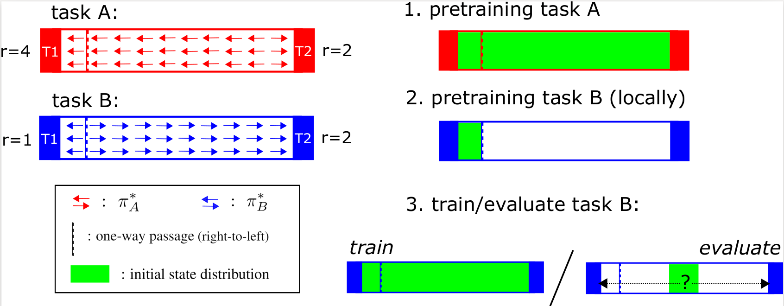
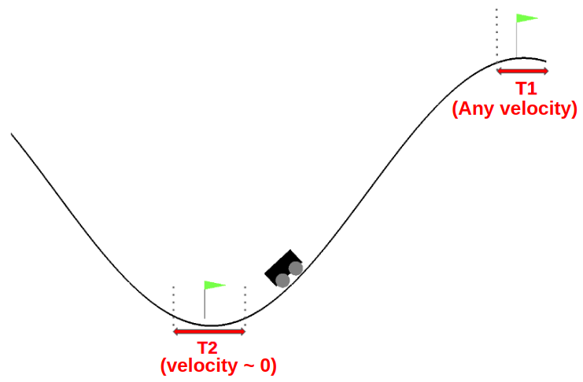

# The LoCA Regret: 

## A Consistent Metric to Evaluate Model-Based Behavior in Reinforcement Learning

we introduce an experimental setup to evaluate model-based behavior of RL methods, 
inspired by work from neuroscience on detecting model-based behavior in humans and animals.

## Setup

Experimental setup for evaluating model-based behavior.  Task A and task B have the same transition dynamics, but a 
reward function that is locally different.$\gamma$ should be close to 1, to ensure that for most of the state-space, an optimal 
agent moves toward the high-reward terminal. An experiment consists of first pretraining a method on task A, 
followed by local pretraining around T1of task B. After pretraining, the agent is trained and evaluated on the full 
environment of task B. The additional training a method needs before it has fully adapted to task B determines the size
 of theLoCA regret.
 
 
 ### Citation:

If you find this work useful, please consider citing our [paper]().
```
@misc{
}
```
<br/>

### Requirements:
To install the requirements you can do:

```
pip install -r requirements.txt
```

### Usage:
* Pre-training + Training: ```python main.py --method sarsa_lambda --env MountainCar ```
* Pre-training with shuffled actions + Training: ```python main.py --env MountainCar --flipped_actions```
* Training: ```python main.py --env MountainCar --no_pre_training ```
* Visualize results : ```tensorboard --logdir=/results```

|Arguments | Description|
|:-------------|:-------------|
| `--method` {sarsa_lambda, MuZero}                      |Name of the algorithm|
| `--env`    {MountainCar}                      |Name of the environment|
| `----no_pre_training`            |Skip the pretraining phase|
| `----flipped_actions`          |pretrain with shuffled actions to cancel the effect of model learning|

### MountainCar
We adopted MountainCar env for LOCA regret calculation. In our variation, the existing terminal state at the top of the 
hill corresponds with T1; we added an additional terminal state to the domain, T2, that corresponds with the cart being 
at the bottom of the hill with a velocity close to 0.


